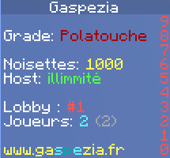
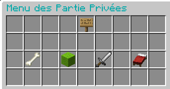
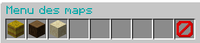

Les parties privées ont été développées en vu d'une forte demande de la communauté.
Ce tout nouveau système te permet de parmi celles proposées par Gaspézia mais également de modifier
toutes les règles de nos mini-jeux ! Avec le système de parties privées, plus aucune partie ne se ressemble.

 

## Comment créer une partie privée ?
**Première étape**, il te faut disposer de points de host. Vas sur le **Lobby** et regarder dans le
**scoreboard** comme le montre l'image ci-dessous. Tu peux également utiliser la commande **/host show**.

!!!
Si tu possèdes le grade VIP tu peux lancer des hosts en illimité !
!!!

**Deuxième étape**, utilises le bloc de commande qui se trouve dans la barre de ton inventaire afin d'ouvrir le menu dédié.

**Troisième étape**, choisis le mode de jeu que tu souhaites lancer en partie privée en cliquant sur l'objet correspondant.
Dans notre exemple nous allons prendre le mode de jeu LoupGarou (l'item est l'os).

**Quatrième étape**, choisis la map de ton choix. Tu peux également laisser le serveur choisir pour toi en sélectionnant le bloc barrier (tout à droite).

Tu seras envoyé sur ton serveur une fois qu'il sera prêt.

**Cinquième étape**, configures ton serveur en utilisant la commande **/host** ou la **boussole** dans ton inventaire 
pour ouvrir le menu de configuration de la partie.

!!!
Pour t'aider à configurer ton serveur, tu peux ajouter un cohoster avec la commande /host addcohost (pseudo)
!!!

Voici quelques autres commandes qui pourront t'être utile pour gérer ta partie privée :

| **Commandes**      |                       **Description**                       |
|:-------------------|:-----------------------------------------------------------:|
| /host ban          |      permet de bannir un joueur de ses parties privées      |
| /host unban        |     permet de débanir quelqu'un de ses parties privées      |
| /host kick         |      permet d'exclure un joueur de la partie en cours       |
| /host unkick       |   permet de réaccepter quelqu'un dans la partie en cours    |
| /host create       |           permet de créer un host depuis le lobby           |
| /host cohostadd    | permet de fournir les droits de gestion du host à un joueur |
| /host cohostremove | permet de retirer les droits de gestion du host à un joueur |
| /wl on             |          permet d'activer la whitelist sur un host          |
| /wl off            |        permet de désactiver la whitelist sur un host        |
| /wl add            |          permet d'ajouter un joueur à la whitelist          |
| /wl remove         |        permet de supprimer un joueur de la whitelist        |

!!!warning
D'autres commandes sont disponibles en fonction des modes de jeux, pour toutes les retrouver nous t'invitons à directement 
aller sur les pages des mini-jeux corrrespondant.
!!!